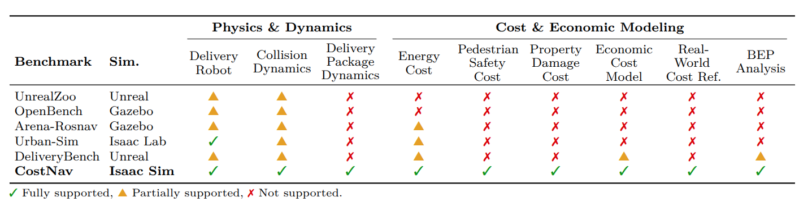
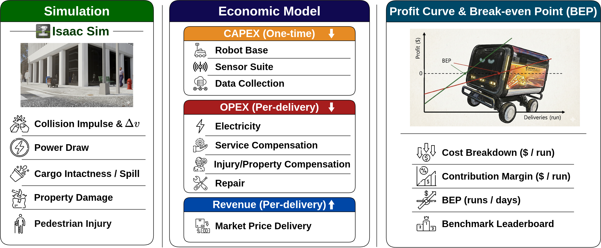

# CostNav


<div align="center">
  <a href="https://arxiv.org/abs/2511.20216"></a>
  <a href="https://worv.ghost.io/costnav-2/"></a>
  <a href="https://github.com/worv-ai/CostNav/issues"></a>
  <a href="https://github.com/worv-ai/CostNav/stargazers"></a>
  <a href="https://github.com/worv-ai/CostNav"></a>
  
  
  
  <a href="https://worv-ai.github.io/costnav/"></a>

  <h3>CostNav: A Navigation Benchmark for Real-World Economic-Cost Evaluation of Physical AI Agents</h3>
</div>

---

## Overview

CostNav introduces a **paradigm shift** in how we evaluate navigation systems: from purely technical metrics to actual economic cost and revenue.

Our key contributions are:

1. **High-Fidelity Physics Simulation with Dynamics for effective Real-World Economic Scenarios.**
   - Supporting Segway E1 delivery robot, food cargo dynamics with popcorn, detailed collision dynamics, pedestrians
1. **Real-world referenced Cost-Revenue Model with Break-Even Point Analysis.**
   - Supporting Energy Cost, Pedestrian Safety Cost, Property Damage Cost, Repair Cost
1. **Rule-Based and Learning-Based Navigation Evaluation with Multiple IL Baselines**
   - Comparing Profitability between Nav2 with GPS and Nav2 with AMCL localization
   - IL Baselines: ViNT, GNM, NoMaD, NavDP, and CANVAS

You can find more details in our [technical report](https://arxiv.org/abs/2511.20216).

The full cost benchmark formula with real world references is available in our google drive: https://drive.google.com/drive/folders/1j1MXm6NMkd6HHBwTJi_nSde7-shv4laX?usp=sharing

## Media

<video src="https://github.com/worv-ai/CostNav/raw/main/docs/assets/videos/comparison_part1.mp4" controls></video>

### Navigation Comparison

<video src="https://github.com/worv-ai/CostNav/raw/main/docs/assets/videos/comparison_part2.mp4" controls></video>

Side-by-side comparison of rule-based and learning-based navigation methods in CostNav's urban sidewalk environment.

### Physics Simulation

<video src="https://github.com/worv-ai/CostNav/raw/main/docs/assets/videos/costnav_popcorn.mp4" controls></video>

CostNav's high-fidelity physics simulation enables the modeling of real-world economic scenarios, including critical failures like food spoilage and robot rollovers.

### Benchmark Comparison



Comparison of existing navigation benchmarks (UnrealZoo, OpenBench, Arena-RosNav, Urban-Sim, DeliveryBench) that focus on task-oriented metrics versus CostNav's integration of physics simulation with comprehensive economic cost modeling.

### Economic Model



CostNav's framework linking navigation performance to business value through profit-per-run measurement.

## Documentation

Full documentation is available at **[worv-ai.github.io/CostNav](https://worv-ai.github.io/CostNav/)**.

| Guide | Description |
|:------|:------------|
| [Quick Reference](https://worv-ai.github.io/CostNav/quick_reference/) | Installation, commands, and project structure |
| [Assets Setup](https://worv-ai.github.io/CostNav/assets_setup/) | Download and configure Omniverse USD assets |
| [Isaac Sim Integration](https://worv-ai.github.io/CostNav/isaacsim_guide/) | Mission manager, ROS2 topics, and launch.py reference |
| [Nav2 Baseline](https://worv-ai.github.io/CostNav/nav2_baseline/) | Rule-based navigation with ROS2 Nav2 |
| [IL Baselines](https://worv-ai.github.io/CostNav/baselines/) | ViNT, NoMaD, GNM, NavDP, and CANVAS |
| [Teleoperation](https://worv-ai.github.io/CostNav/teleop_guide/) | Joystick-based robot control for data collection |
| [Evaluation](https://worv-ai.github.io/CostNav/evaluation/) | Unified eval script, metrics, and log output |
| [Cost Model](https://worv-ai.github.io/CostNav/cost_model/) | CAPEX, OPEX, revenue, and break-even analysis |
| [Contributing](https://worv-ai.github.io/CostNav/contributing/) | How to contribute, roadmap, and PR guidelines |

## Contributing

Help us build a large-scale, ever-expanding benchmark!
We highly encourage contributions via issues and pull requests, especially adding more navigation baselines!

## Citation

To Cite CostNav, please use the following bibtex citation

```
@misc{seong2026costnavnavigationbenchmarkrealworld,
      title={CostNav: A Navigation Benchmark for Real-World Economic-Cost Evaluation of Physical AI Agents},
      author={Haebin Seong and Sungmin Kim and Yongjun Cho and Myunchul Joe and Geunwoo Kim and Yubeen Park and Sunhoo Kim and Yoonshik Kim and Suhwan Choi and Jaeyoon Jung and Jiyong Youn and Jinmyung Kwak and Sunghee Ahn and Jaemin Lee and Younggil Do and Seungyeop Yi and Woojin Cheong and Minhyeok Oh and Minchan Kim and Seongjae Kang and Samwoo Seong and Youngjae Yu and Yunsung Lee},
      year={2026},
      eprint={2511.20216},
      archivePrefix={arXiv},
      primaryClass={cs.AI},
      url={https://arxiv.org/abs/2511.20216},
}
```
