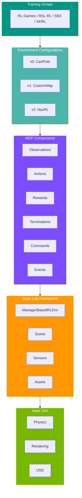
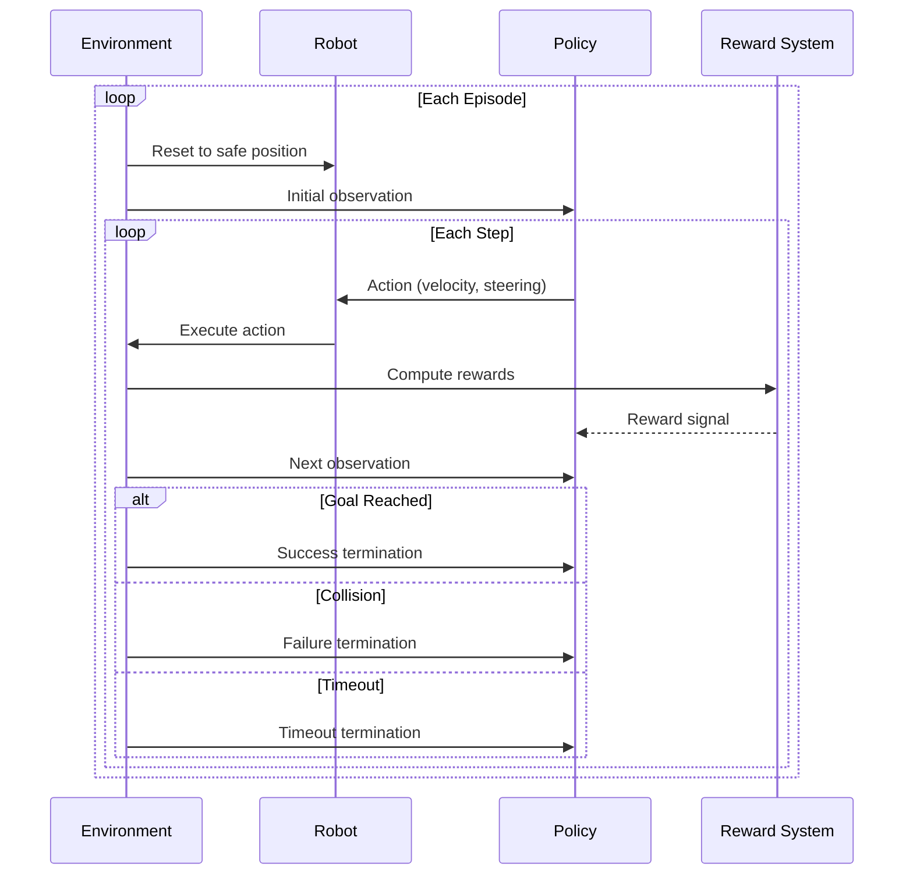
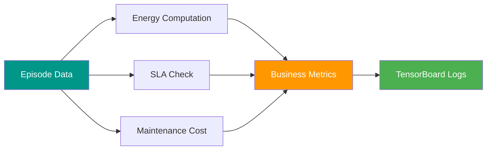

# :building_construction: Architecture Overview

This document provides a comprehensive overview of the CostNav codebase architecture, explaining how different components work together to create a cost-driven navigation benchmark for sidewalk robots.

---

## :telescope: High-Level Architecture

CostNav is built on top of NVIDIA Isaac Sim and Isaac Lab, providing a simulation environment for evaluating navigation policies with business-oriented metrics.



---

## :file_folder: Directory Structure

### :package: Core Source Code

```
costnav_isaaclab/source/costnav_isaaclab/costnav_isaaclab/
├── __init__.py                    # Package initialization, environment registration
├── compat.py                      # Compatibility layer for Gymnasium and Isaac Lab
├── rl_games_helpers.py           # Helper functions for RL-Games integration
├── ui_extension_example.py       # UI extension example
└── tasks/                        # Task implementations
    └── manager_based/            # Manager-based environment tasks
        ├── costnav_isaaclab_v0/  # Version 0: CartPole baseline
        ├── costnav_isaaclab_v1_CustomMap/  # Version 1: Custom map navigation
        └── costnav_isaaclab_v2_NavRL/      # Version 2: Full navigation with RL
            ├── __init__.py
            ├── costnav_isaaclab_env_cfg.py  # Main environment configuration
            ├── coco_robot_cfg.py            # COCO robot configuration
            ├── safe_positions_auto_generated.py  # Pre-validated spawn positions
            └── mdp/                         # MDP component implementations
                ├── __init__.py
                ├── commands.py              # Command generators
                ├── observations.py          # Observation functions
                ├── rewards.py               # Reward functions
                ├── terminations.py          # Termination conditions
                └── events.py                # Event handlers
```

### :hammer_and_wrench: Scripts

```
costnav_isaaclab/scripts/
├── list_envs.py              # List all registered environments
├── test_controller.py        # Test deterministic controller
├── test_v2_rewards.py        # Test reward functions
├── zero_agent.py             # Zero action baseline
├── random_agent.py           # Random action baseline
└── rl_games/                 # RL-Games training scripts
    ├── train.py              # Training script
    ├── play.py               # Inference/visualization script
    └── evaluate.py           # Evaluation script
```

---

## :jigsaw: Key Components

### 1. :gear: Environment Configuration

The environment configuration (`costnav_isaaclab_env_cfg.py`) defines the complete MDP specification:

| Component | Description |
|:----------|:------------|
| **Scene Configuration** | Defines all assets in the simulation (robot, map, sensors) |
| **Observation Configuration** | Specifies what the agent observes |
| **Action Configuration** | Defines the action space |
| **Command Configuration** | Goal generation and command management |
| **Reward Configuration** | Reward function components and weights |
| **Termination Configuration** | Success and failure conditions |
| **Event Configuration** | Reset and initialization logic |

### 2. :brain: MDP Components

```mermaid
graph LR
    subgraph Commands
        SAFE[SafePositionPose2dCommand]
    end

    subgraph Observations
        POSE[pose_command_2d]
        RGBD[rgbd_processed]
        LINV[base_lin_vel]
        ANGV[base_ang_vel]
    end

    subgraph Rewards
        POS_ERR[position_error]
        HEAD_ERR[heading_error]
        MOVE[moving_towards_goal]
        PROG[distance_progress]
        ARR[arrived_reward]
        COL[collision_penalty]
    end

    subgraph Terminations
        ARRIVE[arrive]
        CRASH[collision]
        TIME[time_out]
    end

    Commands --> Observations
    Observations --> Rewards
    Rewards --> Terminations

    style Commands fill:#009688,color:#fff
    style Observations fill:#2196f3,color:#fff
    style Rewards fill:#4caf50,color:#fff
    style Terminations fill:#f44336,color:#fff
```



#### :compass: Commands (`mdp/commands.py`)

| Command | Description |
|:--------|:------------|
| `SafePositionPose2dCommand` | Generates navigation goals from pre-validated safe positions |
| Goal Validation | Ensures goals are not inside buildings or obstacles |
| Heading Modes | Supports both simple heading (pointing towards goal) and random heading |

#### :eye: Observations (`mdp/observations.py`)

| Observation | Description |
|:------------|:------------|
| `pose_command_2d` | 2D goal position in robot's base frame |
| `rgbd_processed` | RGB-D camera images (normalized and processed) |
| `base_lin_vel` | Robot's linear velocity |
| `base_ang_vel` | Robot's angular velocity |

#### :trophy: Rewards (`mdp/rewards.py`)

| Reward | Type | Description |
|:-------|:-----|:------------|
| `position_command_error_tanh` | :green_circle: Positive | Reward for being close to goal |
| `heading_command_error_abs` | :red_circle: Penalty | Penalty for heading error |
| `moving_towards_goal_reward` | :green_circle: Positive | Reward for velocity towards goal |
| `distance_to_goal_progress` | :green_circle: Positive | Reward for reducing distance to goal |
| `arrived_reward` | :star: Bonus | Large reward for reaching goal |
| `collision_penalty` | :red_circle: Penalty | Penalty for collisions |

#### :stop_sign: Terminations (`mdp/terminations.py`)

| Condition | Type | Description |
|:----------|:-----|:------------|
| `arrive` | :white_check_mark: Success | Within threshold of goal |
| `collision` | :x: Failure | Contact force exceeds threshold |
| `time_out` | :hourglass: Timeout | Episode length limit |

#### :zap: Events (`mdp/events.py`)

| Event | Description |
|:------|:------------|
| `reset_base` | Reset robot to safe position with random orientation |
| `print_rewards` | Debug logging of reward components |

### 3. :robot: Robot Configuration (`coco_robot_cfg.py`)

Defines the COCO delivery robot:

| Component | Details |
|:----------|:--------|
| **Physical Properties** | Mass, inertia, collision shapes |
| **Wheel Actuators** | DelayedPDActuator for realistic wheel dynamics |
| **Axle Actuator** | DCMotor for steering |
| **Shock Actuator** | ImplicitActuator for suspension |
| **Action Space** | RestrictedCarAction (velocity and steering angle) |
| **Sensors** | Cameras, contact sensors |

### 4. :world_map: Scene Configuration

The scene includes:

- **Custom Map**: USD file from Omniverse Nucleus (sidewalk environment)
- **Robot**: COCO delivery robot with sensors
- **Contact Sensors**: For collision detection
- **Cameras**: RGB-D cameras for visual observations

---

## :arrows_counterclockwise: Data Flow

### :repeat: Training Loop



#### Step-by-step:

1. **Environment Reset** :arrows_counterclockwise:
    - Robot spawned at safe position (from `safe_positions_auto_generated.py`)
    - Goal sampled from safe positions
    - Sensors initialized

2. **Observation Collection** :eye:
    - Goal position transformed to robot's base frame
    - RGB-D images captured and processed
    - Robot state (velocity, orientation) collected
    - All observations concatenated into policy input

3. **Action Execution** :joystick:
    - Policy outputs action (velocity, steering angle)
    - Action processed by `RestrictedCarAction`
    - Low-level joint commands sent to actuators
    - Physics simulation steps forward

4. **Reward Computation** :moneybag:
    - Multiple reward components computed
    - Weighted sum produces total reward
    - Reward components logged for analysis

5. **Termination Check** :checkered_flag:
    - Check if robot reached goal (success)
    - Check if robot collided (failure)
    - Check if episode timeout reached

6. **Repeat** until termination, then reset

---

## :link: Integration with Isaac Lab

CostNav extends Isaac Lab's `ManagerBasedRLEnv`:

| Component | Description |
|:----------|:------------|
| **Managers** | Observation, Action, Command, Reward, Termination, Event managers |
| **Scene** | Interactive scene with assets and sensors |
| **Simulation** | Physics simulation context |
| **Logging** | TensorBoard integration for metrics |

---

## :chart_with_upwards_trend: Cost Model Integration

The `rl_games_helpers.py` module provides cost model integration:



- **Energy Computation**: `compute_navigation_energy_step()` calculates power consumption
- **Business Metrics**: SLA compliance, operational costs, profitability
- **Logging**: Custom scalars for TensorBoard

!!! tip "Business-Oriented Evaluation"
    These metrics are computed during training and logged alongside standard RL metrics, enabling evaluation of policies based on business objectives rather than just task success.
