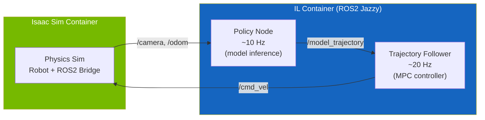
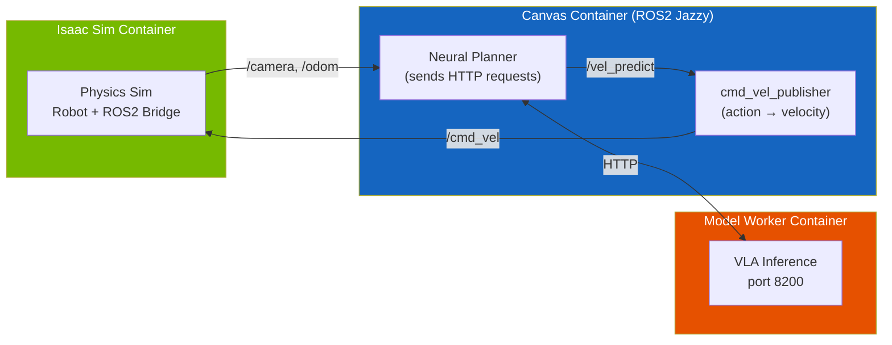

# :compass: IL Baselines

CostNav provides **learning-based** (imitation learning) navigation baselines for benchmarking sidewalk robot policies. For rule-based navigation, see **[Nav2 Baseline](nav2_baseline.md)**.

---

## :brain: Imitation Learning Baselines

### Supported Algorithms

| Algorithm  | Type               | Framework             | Goal Support                        |
| ---------- | ------------------ | --------------------- | ----------------------------------- |
| **NavDP**  | Diffusion Policy   | NavDP                 | Point, Image, Pixel, No-Goal, Mixed |
| **ViNT**   | Visual Transformer | visualnav-transformer | Image, No-Goal                      |
| **NoMaD**  | Diffusion Model    | visualnav-transformer | Image, No-Goal                      |
| **GNM**    | General Navigation | visualnav-transformer | Image, No-Goal                      |
| **CANVAS** | Sketch-based       | canvas                | Point Goal                          |

### Architecture

#### ViNT / NoMaD / GNM / NavDP

Two-node ROS2 architecture with local model inference:



#### CANVAS

Three-node architecture with VLA inference (model worker runs on localhost by default):



**Key ROS2 Topics:**

| Topic                                 | Type                  | Direction          | Description                  |
| ------------------------------------- | --------------------- | ------------------ | ---------------------------- |
| `/front_stereo_camera/left/image_raw` | `sensor_msgs/Image`   | Isaac Sim → Policy | Camera images                |
| `/chassis/odom`                       | `nav_msgs/Odometry`   | Isaac Sim → Policy | Robot odometry               |
| `/cmd_vel`                            | `geometry_msgs/Twist` | Policy → Isaac Sim | Velocity commands            |
| `/model_trajectory`                   | `nav_msgs/Path`       | Internal           | Policy → Trajectory Follower |

### Running IL Baselines

```bash
# Build shared ROS2 + PyTorch image (first time only)
make build-ros2-torch

# Run a specific baseline
make run-vint
make run-nomad
make run-gnm
make run-navdp

# Canvas requires its own Docker image
make build-canvas
make run-canvas
```

> **Tip:** For Canvas, the model worker launches on localhost by default.
> To offload it to a separate GPU server for better performance, launch the worker on the remote machine
> and override `MODEL_WORKER_URI`:
> ```bash
> # On the remote GPU server:
> cd costnav_isaacsim/canvas/apps/model_workers
> cp .env.pub .env  # Edit .env: set MODEL_PATH
> docker compose --env-file .env up
>
> # On the local machine:
> make run-canvas MODEL_WORKER_URI=http://<gpu-server>:<port>
> ```
> The local model worker is automatically skipped when the URI points to a remote host.

**Navigation mode override** — switch between `image_goal` and `topomap`:

```bash
# Image-goal mode
GOAL_TYPE=image_goal MODEL_CHECKPOINT=checkpoints/nomad.pth make run-nomad

# Topomap mode
GOAL_TYPE=topomap MODEL_CHECKPOINT=checkpoints/nomad.pth make run-nomad
```

### Automated Evaluation

```bash
# Run evaluation with default settings
make run-eval-vint
make run-eval-gnm
make run-eval-nomad
make run-eval-navdp
make run-eval-canvas

# Custom parameters
make run-eval-vint TIMEOUT=120 NUM_MISSIONS=10
```

Logs saved to `./logs/<baseline>_evaluation_<timestamp>.log`.

### Data Collection & Training

#### Data Collection

Teleoperation data is collected via:

```bash
make teleop
```

#### Data Processing Pipeline

```
ROS2 Bags → MediaRef → Processing → ViNT Format
```

```bash
cd CostNav/costnav_isaacsim

# Install dependencies
uv sync

# Step 1: Convert ROS bags to MediaRef
uv run python -m il_training.data_processing.converters.ray_batch_convert \
    --config data_processing/configs/processing_config.yaml

# Step 2: Convert to ViNT format
uv run python -m il_training.data_processing.process_data.process_mediaref_bags \
    --config data_processing/configs/vint_processing_config.yaml
```

#### Training

Download pretrained checkpoints first:

```bash
make download-baseline-checkpoints-hf
```

Train models (ViNT, NoMaD, GNM, NavDP):

```bash
cd CostNav/costnav_isaacsim

# Train ViNT
uv run python -m il_training.training.train_vint \
    --config il_training/training/visualnav_transformer/configs/vint_costnav.yaml

# Train NoMaD
uv run python -m il_training.training.train_vint \
    --config il_training/training/visualnav_transformer/configs/nomad_costnav.yaml

# Train NavDP
uv run python -m il_training.training.train_navdp \
    --config il_training/training/configs/navdp_costnav.yaml
```

For SLURM cluster training:

```bash
cd costnav_isaacsim/il_training/scripts/
sbatch train_vint.sbatch
sbatch train_nomad.sbatch
sbatch train_navdp.sbatch
```

!!! warning "CANVAS Training Not Open-Sourced"
CANVAS training code is not included in this repository. Only pretrained checkpoints and the inference pipeline (model worker + agent) are provided.

### NavDP Data Processing

NavDP requires a separate data processing step to convert teleoperation data into its LeRobot-compatible format with DepthAnything depth estimation:

```bash
cd CostNav/costnav_isaacsim

# Convert MediaRef bags to NavDP format (with DepthAnything depth)
uv run python -m il_training.data_processing.process_data.process_mediaref_bags \
    --config data_processing/configs/navdp_processing_config.yaml
```

NavDP training uses point+image fusion with DepthAnything-generated depth maps, 24-step trajectory prediction, and 8-frame context windows.

### Baseline Comparison

| Feature               | ViNT          | NoMaD         | GNM           | NavDP               |
| --------------------- | ------------- | ------------- | ------------- | ------------------- |
| **Architecture**      | Transformer   | Diffusion     | CNN           | Diffusion + Critic  |
| **Goal Support**      | Image, NoGoal | Image, NoGoal | Image, NoGoal | Point, Image, Pixel |
| **Trajectory Length** | 8 waypoints   | 8 waypoints   | 5 waypoints   | 24 waypoints        |
| **Context Frames**    | 5             | 5             | 5             | 8                   |

### Heading Alignment

!!! warning "IL baselines require heading alignment"
    IL baselines (ViNT, GNM, NoMaD, NavDP) default to `ALIGN_HEADING=True`. Disabling this will cause poor performance — these models are trained on forward-moving demonstration trajectories and cannot handle arbitrary initial headings (out-of-distribution observations).

This aligns the robot's initial heading with the first topomap waypoint direction before navigation begins.

| Method | `ALIGN_HEADING` default | Reason                                       |
| ------ | ----------------------- | -------------------------------------------- |
| Nav2   | `False`                 | Classical planner handles arbitrary headings |
| Canvas | `False`                 | Learned policy handles arbitrary headings    |
| ViNT   | **`True`**              | IL model requires aligned initial heading    |
| GNM    | **`True`**              | IL model requires aligned initial heading    |
| NoMaD  | **`True`**              | IL model requires aligned initial heading    |
| NavDP  | **`True`**              | IL model requires aligned initial heading    |

```bash
# Disable for testing
ALIGN_HEADING=False MODEL_CHECKPOINT=checkpoints/baseline-vint.pth make run-vint
```

---

## :bar_chart: Evaluation

See **[Evaluation](evaluation.md)** for the unified eval script, collected metrics, and log output.

---

## :link: References

### Research Papers

1. **GNM**: Shah et al., "[GNM: A General Navigation Model to Drive Any Robot](https://general-navigation-models.github.io/)", ICRA 2023
2. **ViNT**: Shah et al., "[ViNT: A Foundation Model for Visual Navigation](https://general-navigation-models.github.io/vint/)", CoRL 2023
3. **NoMaD**: Sridhar et al., "[NoMaD: Goal Masking Diffusion Policies for Navigation and Exploration](https://general-navigation-models.github.io/nomad/)", ICRA 2025
4. **NavDP**: Cai et al., "[NavDP: Learning Sim-to-Real Navigation Diffusion Policy](https://wzcai99.github.io/navigation-diffusion-policy.github.io/)", 2025
5. **CANVAS**: Choi et al., "[CANVAS: Commonsense-Aware Navigation System](https://worv-ai.github.io/canvas/)", ICRA 2025

### Code

- [visualnav-transformer](https://github.com/robodhruv/visualnav-transformer) — ViNT, NoMaD, GNM
- [NavDP](https://github.com/OpenRobotLab/NavDP) — Navigation diffusion policy
- [MediaRef](https://github.com/open-world-agents/MediaRef) — Lightweight media references
