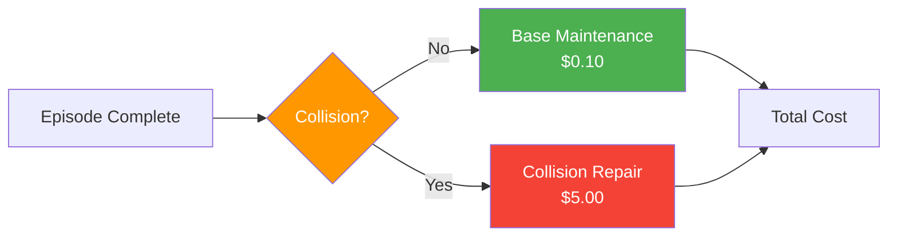
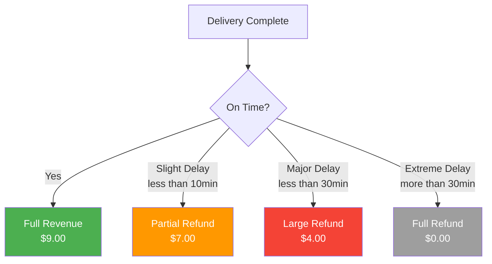
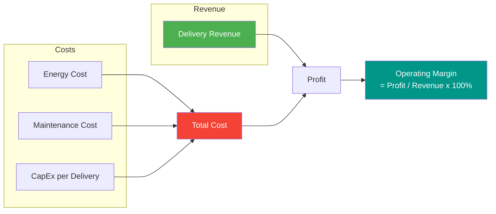
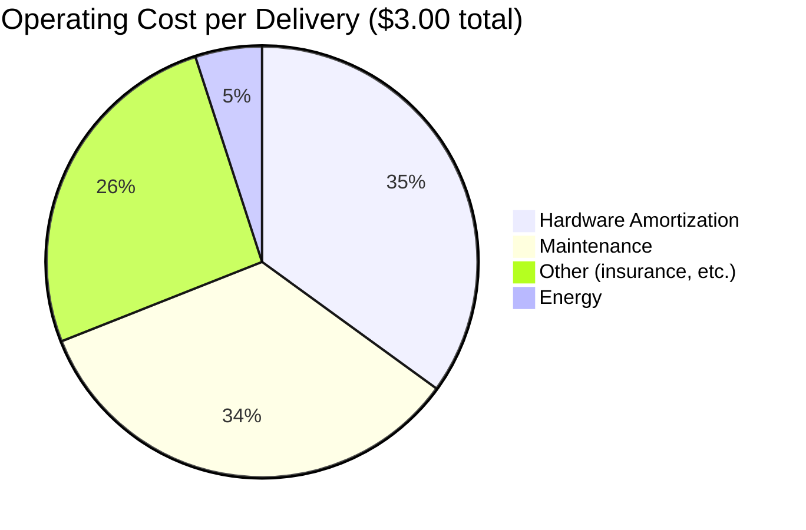

# :moneybag: Cost Model and Business Metrics

This document explains CostNav's cost model, which evaluates navigation policies based on business metrics rather than just task success.

---

## :dart: Overview

Traditional robotics benchmarks focus on **technical metrics**:

- :white_check_mark: Success rate
- :straight_ruler: Path length
- :boom: Collision rate
- :stopwatch: Computation time

CostNav adds **business-oriented metrics**:

| Metric | Description |
|:-------|:------------|
| :clock1: **SLA Compliance** | Meeting delivery time commitments |
| :zap: **Operational Cost** | Energy, maintenance, repairs |
| :chart_with_upwards_trend: **Profitability** | Revenue minus costs |
| :calendar: **Break-even Time** | Time to recover initial investment |

!!! success "Why This Matters"
    This enables evaluation of policies based on **real-world deployment viability**, not just simulation performance.

---

## :building_construction: Cost Model Components

### 1. :office: Capital Expenditure (CapEx)

**Robot Hardware Cost**: Initial investment in robot platform

```python
robot_cost = $15,000  # Estimated COCO robot cost
operating_years = 5   # Expected lifetime
annual_capex = robot_cost / operating_years = $3,000/year
```

| Component | Description |
|:----------|:------------|
| **Hardware cost** | Spread over operating lifetime |
| **Depreciation** | Accounted for in amortization |
| **Includes** | Sensors, compute, chassis |

---

### 2. :zap: Energy Costs

**Power Consumption Model:**

```python
def compute_navigation_energy_step(env):
    # Get robot parameters
    mass = 50.0  # kg (COCO robot mass)
    gravity = 9.81  # m/s²

    # Get current velocity
    velocity = norm(robot.root_lin_vel[:, :2])  # Planar velocity

    # Power = m * g * v (simplified model)
    power = mass * gravity * velocity  # Watts

    # Energy per step
    dt = 0.005  # Simulation timestep (5ms)
    energy = power * dt  # Joules

    return energy
```

**Cost Calculation:**

```python
# Accumulate energy over episode
total_energy_joules = sum(energy_per_step)
total_energy_kwh = total_energy_joules / 3.6e6

# Apply electricity rate
electricity_rate = $0.15 / kWh  # US average
energy_cost = total_energy_kwh * electricity_rate
```

**Typical Values:**

| Metric | Range |
|:-------|:------|
| Average power | 50-200 W |
| Energy per delivery | 0.01-0.05 kWh |
| Cost per delivery | $0.0015-$0.0075 |

---

### 3. :wrench: Maintenance Costs



**Collision-Based Maintenance:**

```python
def compute_maintenance_cost(episode):
    # Base maintenance (wear and tear)
    base_maintenance = $0.10  # per delivery

    # Collision damage
    if collision_occurred:
        collision_cost = $5.00  # Average repair cost
    else:
        collision_cost = $0.00

    # Total maintenance
    maintenance_cost = base_maintenance + collision_cost

    return maintenance_cost
```

**Cost Breakdown:**

=== "Routine Maintenance"

    | Item | Cost |
    |:-----|:-----|
    | Tire wear | Included in $0.10 |
    | Battery degradation | Included in $0.10 |
    | Software updates | Included in $0.10 |
    | **Total per delivery** | **$0.10** |

=== "Collision Repairs"

    | Item | Cost |
    |:-----|:-----|
    | Body damage | ~$2.00 |
    | Sensor recalibration | ~$2.00 |
    | Downtime costs | ~$1.00 |
    | **Total per incident** | **$5.00** |

!!! warning "Industry Data"
    Maintenance represents **33.7%** of operating costs. Collision avoidance is a high-leverage improvement area.

---

### 4. :receipt: Revenue Model

**Delivery Revenue** (based on DoorDash, Uber Eats data):

| Platform | Revenue per Delivery |
|:---------|:---------------------|
| DoorDash | $8.49 |
| Uber Eats | $10.00 |
| **Robot baseline** | **$9.00** |

**SLA-Based Revenue:**



```python
def compute_revenue(episode):
    base_revenue = $9.00

    # SLA compliance bonus/penalty
    if delivery_time <= sla_threshold:
        revenue = base_revenue  # On-time delivery
    elif delivery_time <= sla_threshold + 10_minutes:
        revenue = base_revenue - $2.00  # Slight delay
    elif delivery_time <= sla_threshold + 30_minutes:
        revenue = base_revenue - $5.00  # Major delay
    else:
        revenue = $0.00  # Extreme delay: full refund

    return revenue
```

---

### 5. :clock1: SLA Compliance

**Service Level Agreement:**

```python
# Target delivery time
sla_threshold = 30.0  # minutes

# Actual delivery time
delivery_time = episode_length * dt / 60  # Convert to minutes

# SLA compliance
sla_compliant = delivery_time <= sla_threshold
```

**Compliance Rate:**

```python
# Over multiple episodes
sla_compliance_rate = num_compliant_deliveries / total_deliveries

# Baseline: 43.0% (current RL-Games policy)
# Target: 80%+ (competitive with human couriers)
```

---

## :bar_chart: Business Metrics

### 1. :chart_with_upwards_trend: Operating Margin

**Definition:** Profit as percentage of revenue



=== "Successful Delivery :white_check_mark:"

    ```
    Revenue:            $9.00
    Energy cost:        $0.005
    Maintenance cost:   $0.10
    CapEx per delivery: $0.50

    Total cost:         $0.605
    Profit:             $8.395
    Operating margin:   93.3%
    ```

=== "Failed Delivery (Collision) :x:"

    ```
    Revenue:            $0.00 (full refund)
    Energy cost:        $0.003
    Maintenance cost:   $5.10 (includes repair)
    CapEx per delivery: $0.50

    Total cost:         $5.603
    Profit:             -$5.603
    Operating margin:   -∞ (loss)
    ```

!!! info "Baseline Performance"
    - Current RL policy: **46.5%** operating margin
    - Target: **60%+** for sustainable business

---

### 2. :calendar: Break-Even Time

**Definition:** Time to recover initial robot investment

```python
def compute_break_even_time(policy_performance):
    # Initial investment
    robot_cost = $15,000

    # Average profit per delivery
    avg_profit_per_delivery = compute_average_profit(policy_performance)

    # Deliveries per day
    deliveries_per_day = 20  # Assuming 8-hour operation

    # Daily profit
    daily_profit = avg_profit_per_delivery * deliveries_per_day

    # Break-even time
    break_even_days = robot_cost / daily_profit
    break_even_years = break_even_days / 365

    return break_even_years
```

**Example Scenarios:**

| Scenario | Avg Profit | Daily Profit | Break-even |
|:---------|:-----------|:-------------|:-----------|
| :star: High-performing | $4.00 | $80.00 | **0.51 years** |
| :ok: Baseline | $2.00 | $40.00 | **1.03 years** |
| :x: Poor (many collisions) | $0.50 | $10.00 | **4.11 years** |

!!! success "Baseline Performance"
    - Current RL policy: **0.90 years** break-even
    - Target: **<1 year** for attractive ROI

---

### 3. :pie: Cost Breakdown

**Typical Operating Costs** (from baseline policy):



| Category | Cost | Percentage |
|:---------|:-----|:-----------|
| Hardware Amortization | $1.05 | 35% |
| Maintenance | $1.01 | 34% |
| Other (insurance, etc.) | $0.79 | 26% |
| Energy | $0.15 | 5% |
| **Total** | **$3.00** | 100% |

!!! tip "Key Insights"
    - :wrench: Maintenance and hardware dominate costs
    - :boom: Collision avoidance is highest-leverage improvement
    - :zap: Energy optimization has limited impact

---

## :link: Integration with Training

### :pencil: Logging Cost Metrics

Cost metrics are logged during training via `rl_games_helpers.py`:

```python
def on_episode_end(episode_info):
    # Compute cost metrics
    energy = compute_navigation_energy_step(env)
    sla_compliant = check_sla_compliance(episode_info)
    maintenance_cost = compute_maintenance_cost(episode_info)

    # Log to TensorBoard
    writer.add_scalar("cost_model/energy", energy, step)
    writer.add_scalar("cost_model/sla_compliance", sla_compliant, step)
    writer.add_scalar("cost_model/maintenance_cost", maintenance_cost, step)
```

### :brain: Cost-Aware Reward Shaping

!!! note "Future Work"
    Incorporate cost metrics directly into reward function:

```python
def cost_aware_reward(episode):
    # Task reward (reaching goal)
    task_reward = compute_task_reward(episode)

    # Cost penalty
    cost_penalty = (
        energy_cost * energy_weight +
        maintenance_cost * maintenance_weight +
        sla_penalty * sla_weight
    )

    # Total reward
    total_reward = task_reward - cost_penalty

    return total_reward
```

This would enable learning policies that directly optimize for **profitability**.

---

## :balance_scale: Comparison with Human Couriers

### :person_walking: Human Courier Economics

**Costs:**

| Item | Value |
|:-----|:------|
| Pay per delivery | $8.49 - $10.00 |
| Platform fees | 15-30% of order |
| Hardware amortization | None |

**Performance:**

| Metric | Value |
|:-------|:------|
| SLA compliance | 70-80% |
| Delivery time | 26-38 minutes |
| Collision rate | Very low |

### :robot: Robot Courier Economics

**Costs:**

| Item | Value |
|:-----|:------|
| Hardware amortization | $0.50 per delivery |
| Energy | $0.005 per delivery |
| Maintenance | $0.10-$5.10 per delivery |
| Labor | **None** |

**Performance (baseline RL policy):**

| Metric | Value |
|:-------|:------|
| SLA compliance | 43.0% |
| Delivery time | Variable |
| Collision rate | Higher than humans |

### :dart: Break-Even Analysis

For robots to be competitive:

| Requirement | Target | Current | Status |
|:------------|:-------|:--------|:------:|
| SLA compliance | >70% | 43.0% | :x: |
| Collision rate | <5% | Higher | :x: |
| Operating margin | >50% | 46.5% | :x: |
| Break-even time | <1 year | 0.90 years | :white_check_mark: |

!!! warning "Conclusion"
    Significant room for improvement in navigation policy to achieve competitive economics.

---

## :crystal_ball: Future Enhancements

| Enhancement | Description |
|:------------|:------------|
| :cloud: **Cloud Inference Costs** | Model latency and bandwidth costs for cloud-based policies |
| :chart_with_upwards_trend: **Dynamic Pricing** | Adjust revenue based on demand, distance, time of day |
| :truck: **Fleet Management** | Optimize across multiple robots (routing, charging) |
| :shield: **Insurance Costs** | Model liability and insurance based on collision history |
| :memo: **Regulatory Compliance** | Factor in permits, inspections, certifications |
