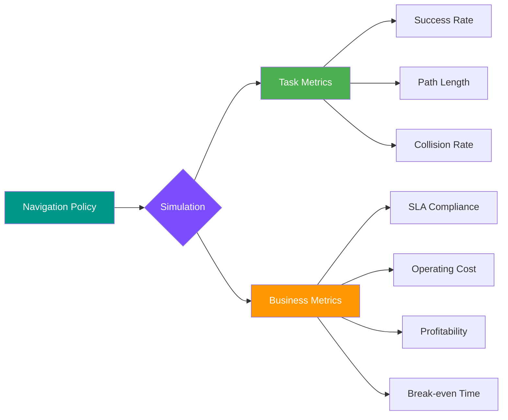

---
hide:
  - navigation
---

# CostNav :robot:

<div align="center" markdown>

[](https://github.com/worv-ai/CostNav/issues)
[](https://github.com/worv-ai/CostNav/stargazers)
[](https://github.com/worv-ai/CostNav)


**A cost-driven navigation benchmark for sidewalk robots, built on Isaac Sim.**

[Quick Start](quick_reference.md){ .md-button .md-button--primary }
[View on GitHub](https://github.com/worv-ai/CostNav){ .md-button }

</div>

---

## :dart: Overview

CostNav supports a wide range of robot platforms and diverse outdoor environments, and evaluates navigation policies with a unified cost model that captures **SLA compliance**, **operational cost**, **profitability**, and **break-even time**.

The toolkit enables scalable variation in robots, payloads, maps, and cloud-inference settings, and supports both learning-based and rule-based navigation stacks—making it easy to prototype and compare cost-aware policies without manual tuning for each scenario.

---

## :star2: Highlights

<div class="grid cards" markdown>

-   :moneybag: **Business-first Benchmark**

    ---

    Policies are evaluated not only on navigation success but also on their operational impact, including robot safety, SLA compliance, profitability, and break-even time—metrics directly tied to real-world deployment.

-   :world_map: **Diverse Environment Suite**

    ---

    CostNav provides tasks spanning urban, suburban, rural, wild, port, and orchard-style maps, all using the COCO delivery robot with mixed observation (vector + RGB-D) pipelines.

-   :rocket: **Roadmap-ready**

    ---

    Hooks are in place to compare learning vs. rule-based stacks, switch between on-device and cloud inference, and study cost-aware reward shaping.

-   :gear: **Built on NVIDIA Isaac**

    ---

    Leverages Isaac Sim's physics engine and Isaac Lab's RL framework for high-fidelity simulation and efficient parallel training.

</div>

---

## :movie_camera: Simulation Overview

### Environments

| Scenario | Description |
|:---------|:------------|
| :cityscape: **Sidewalk** | City-scale sidewalk map featuring crosswalks, curbs, planters, and other street furniture, delivered via Omniverse USD assets for reproducible layouts. |

### Agents

| Agent | Description |
|:------|:------------|
| :truck: **COCO Robot** | Four-wheeled sidewalk courier platform from `coco_robot_cfg.py` with configurable drive models, cameras, and LiDAR for learning or rule-based controllers. |

---

## :book: Documentation

### :zap: Getting Started

| Document | Description |
|:---------|:------------|
| [Architecture Overview](architecture.md) | Understand the codebase structure and how components work together |
| [Environment Versions](environment_versions.md) | Learn about v0, v1, and v2 environments and when to use each |
| [Quick Reference](quick_reference.md) | Essential commands and configurations |

### :brain: Core Concepts

| Document | Description |
|:---------|:------------|
| [MDP Components](mdp_components.md) | Deep dive into observations, actions, rewards, and terminations |
| [Robot Configuration](robot_configuration.md) | COCO robot's physical properties, actuators, and sensors |
| [Cost Model](cost_model.md) | Understanding business metrics: SLA, operational costs, profitability |

### :mortar_board: Guides

| Document | Description |
|:---------|:------------|
| [Training Guide](training_guide.md) | Complete guide to training navigation policies with RL-Games |

### :books: Reference

| Document | Description |
|:---------|:------------|
| [API Reference](api.md) | Auto-generated API documentation for all modules |
| [Scripts Reference](scripts_reference.md) | Comprehensive reference for all training and utility scripts |
| [Food Delivery Business](references/FOOD_DELIVERY_BUSINESS.md) | Industry data and economics for food delivery robots |

---

## :chart_with_upwards_trend: Cost Model at a Glance



!!! info "Why Cost-Driven Evaluation?"
    Traditional benchmarks focus on technical metrics like success rate. CostNav adds business metrics to evaluate real-world deployment viability—because a fast robot that crashes frequently isn't profitable.

---

## :wrench: Quick Installation

=== "pip"

    ```bash
    pip install costnav-isaaclab
    ```

=== "From Source"

    ```bash
    git clone https://github.com/worv-ai/CostNav.git
    cd CostNav
    pip install -e .
    ```

!!! warning "Prerequisites"
    CostNav requires NVIDIA Isaac Sim 5.1.0+ and Isaac Lab 2.3.0+. See [Quick Reference](quick_reference.md) for detailed setup instructions.

---

## :handshake: Contributing

We welcome contributions! Please see our [Contributing Guide](contributing.md) for details on:

- :bug: Reporting bugs
- :bulb: Suggesting features
- :memo: Improving documentation
- :computer: Submitting code changes

---

## :scroll: License

CostNav is released under the MIT License. See the [LICENSE](https://github.com/worv-ai/CostNav/blob/main/LICENSE) file for details.

---

<div align="center" markdown>

**Made with :heart: by [Worv AI](https://github.com/worv-ai)**

</div>
