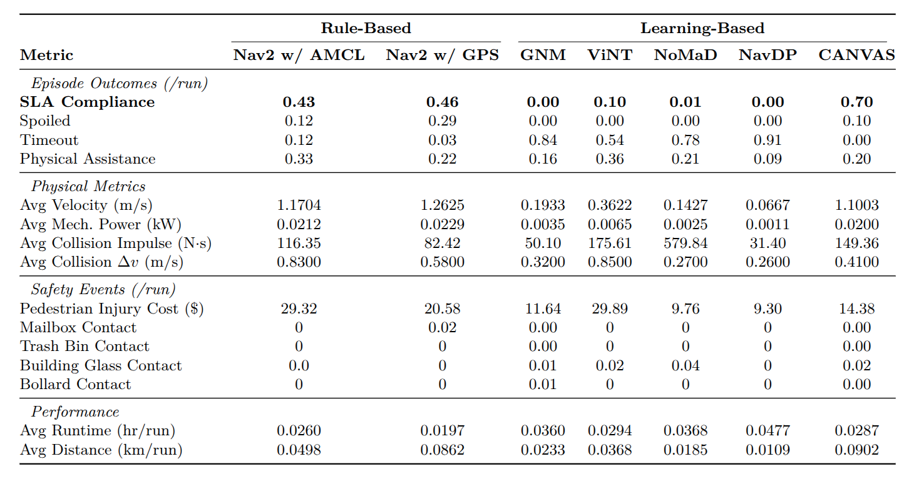
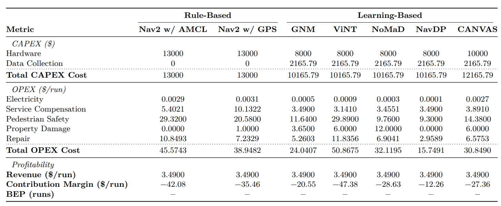

# CostNav :robot:

<div style="text-align: center;" markdown="1">

[](https://arxiv.org/abs/2511.20216)
[](https://github.com/worv-ai/CostNav)
[](https://huggingface.co/datasets/maum-ai/CostNav)
[](https://huggingface.co/datasets/maum-ai/CostNav-Teleop-Dataset)
[](https://huggingface.co/maum-ai/CostNav_baseline)


**A cost-driven navigation benchmark for sidewalk robots, built on Isaac Sim.**

</div>

---

<figure markdown="span">
  { width="100%" }
</figure>

## :dart: Overview

CostNav evaluates navigation policies with a unified cost model that captures **SLA compliance**, **operational cost**, **profitability**, and **break-even time**---not just success rate.

The toolkit supports a wide range of robot platforms and diverse outdoor environments, enabling scalable variation in robots, payloads, maps, and cloud-inference settings. Both learning-based and rule-based navigation stacks are supported, making it easy to prototype and compare cost-aware policies.

## :star2: Highlights

- :moneybag: **Business-first benchmark:** Policies are evaluated on operational impact---robot safety, SLA compliance, profitability, and break-even time---metrics directly tied to real-world deployment.
- :world_map: **Diverse environment suite:** Tasks span urban, suburban, rural, wild, port, and orchard-style maps, all using the Segway E1 delivery robot with mixed observation (vector + RGB-D) pipelines.
- :rocket: **Roadmap-ready:** Hooks are in place to compare learning vs. rule-based stacks, switch between on-device and cloud inference, and study cost-aware reward shaping.

## :zap: Quick Start

### Prerequisites

- Linux host PC (Ubuntu 24.04 preferred)
- NVIDIA GPU with recent graphics drivers
- Docker with NVIDIA container toolkit

### Setup

```bash
git clone https://github.com/worv-ai/CostNav.git && cd CostNav
make fetch-third-party

cp .env.example .env
# Set NGC_PASS (https://org.ngc.nvidia.com/setup/api-keys)
# Set PROJECT_ROOT as the absolute path of cloned CostNav
# Set HF_TOKEN (https://huggingface.co/settings/tokens)

make build-ros2
make build-isaac-sim

make download-assets-hf            # requires HF_TOKEN
make download-baseline-checkpoints-hf  # download pretrained IL models
make start-nucleus
```

### Running

=== "Nav2 (Rule-Based Navigation)"

    ```bash
    make run-nav2
    # Defaults: NUM_PEOPLE=20 SIM_ROBOT=segway_e1 FOOD=True TUNED=True AMCL=False

    # Then run ONE of the following:
    make start-mission    # single mission
    make run-eval-nav2    # batch evaluation
    ```

=== "Canvas (VLA Learning-Based Navigation)"

    ```bash
    # 1. Build the Canvas Docker image
    make build-canvas

    # 2. Launch the model worker on a GPU server
    cd costnav_isaacsim/canvas/apps/model_workers
    cp .env.pub .env
    # Edit .env: set MODEL_PATH to your checkpoint directory
    #   MODEL_PATH=<path_to>/checkpoints/canvas-costnav
    docker compose --env-file .env up
    # Listens on port 8200 by default
    cd -

    # 3. Start Isaac Sim + Canvas agent
    make run-canvas
    # Default: MODEL_WORKER_URI=http://localhost:8200

    # 4. Run evaluation
    make run-eval-canvas
    ```

    See **[Baselines](baselines.md)** for detailed Canvas model worker setup.

See **[Quick Reference](quick_reference.md)** for all commands.

## :movie_camera: Simulation Overview

### Environments

| Scenario             | Description                                                                                                                                             |
| :------------------- | :------------------------------------------------------------------------------------------------------------------------------------------------------ |
| :cityscape: Sidewalk | City-scale sidewalk map featuring crosswalks, curbs, planters, and other street furniture, delivered via Omniverse USD assets for reproducible layouts. |

### Agents

| Agent             | Description                                                                                                                       |
| :---------------- | :-------------------------------------------------------------------------------------------------------------------------------- |
| :truck: Segway E1 | Four-wheeled sidewalk courier platform with configurable drive models, cameras, and LiDAR for learning or rule-based controllers. |

<video controls autoplay muted loop playsinline style="width: 100%; max-width: 100%;">
  <source src="assets/videos/costnav_popcorn.mp4" type="video/mp4">
</video>

<p style="text-align: center;"><em>High-fidelity physics simulation enables modeling of real-world economic scenarios, including food spoilage and robot rollovers.</em></p>

## :chart_with_upwards_trend: Cost Model

<figure markdown="span">
  { width="100%" }
</figure>


CostNav separates **CAPEX** (robot hardware, sensors) from per-run **OPEX** (energy, maintenance, collision costs, service compensation). Revenue is determined by SLA compliance and cargo intactness:

- **Per-run profit** = revenue - operating costs
- **Break-even point (BEP)** = fixed costs / contribution margin

Cost parameters are grounded in real-world data: SEC filings, AIS injury reports, manufacturer specs, U.S. wage/electricity statistics, and delivery platform pricing.

See **[Cost Model](cost_model.md)** for implementation details.

## :bar_chart: Baseline Results

Seven baselines evaluated over 100 delivery episodes:

- **Rule-based:** Nav2 w/ AMCL, Nav2 w/ GPS (360-degree 3D LiDAR)
- **Learning-based:** GNM, ViNT, NoMaD, NavDP, CANVAS (RGB camera; CANVAS + GPS)

<figure markdown="span">
  { width="100%" }
</figure>

No method is currently economically viable. Best: CANVAS at -27.36$/run. Pedestrian safety costs dominate across all methods.

<figure markdown="span">
  { width="100%" }
</figure>

<video controls autoplay muted loop playsinline style="width: 100%; max-width: 100%;">
  <source src="assets/videos/comparison_part2.mp4" type="video/mp4">
</video>

See **[Baselines](baselines.md)** for reproduction instructions.

## :book: Documentation

### :book: User Guide

- **[Quick Reference](quick_reference.md)**: Installation, commands, and project structure
- **[Assets Setup](assets_setup.md)**: Download and configure Omniverse USD assets
- **[Isaac Sim Integration](isaacsim_guide.md)**: Mission manager, ROS2 topics, and launch.py reference
- **[Nav2 Baseline](nav2_baseline.md)**: Rule-based navigation with ROS2 Nav2
- **[IL Baselines](baselines.md)**: ViNT, NoMaD, GNM, NavDP, and CANVAS
- **[Teleoperation](teleop_guide.md)**: Joystick-based robot control for data collection
- **[Topomap Pipeline](topomap_pipeline.md)**: Generate ViNT-compatible topological maps from NavMesh
- **[Evaluation](evaluation.md)**: Unified eval script, metrics, and log output

### :moneybag: Cost Model

- **[Cost Model](cost_model.md)**: CAPEX, OPEX, revenue, and break-even analysis with real-world referenced parameters

## :page_facing_up: Citation

```bibtex
@misc{seong2026costnavnavigationbenchmarkrealworld,
      title={CostNav: A Navigation Benchmark for Real-World Economic-Cost Evaluation of Physical AI Agents},
      author={Haebin Seong and Sungmin Kim and Yongjun Cho and Myunchul Joe and Geunwoo Kim and Yubeen Park and Sunhoo Kim and Yoonshik Kim and Suhwan Choi and Jaeyoon Jung and Jiyong Youn and Jinmyung Kwak and Sunghee Ahn and Jaemin Lee and Younggil Do and Seungyeop Yi and Woojin Cheong and Minhyeok Oh and Minchan Kim and Seongjae Kang and Samwoo Seong and Youngjae Yu and Yunsung Lee},
      year={2026},
      eprint={2511.20216},
      archivePrefix={arXiv},
      primaryClass={cs.AI},
      url={https://arxiv.org/abs/2511.20216},
}
```
