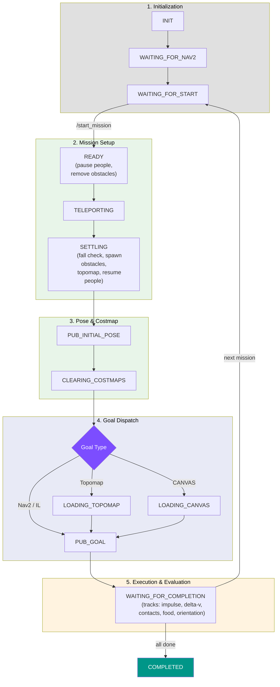

# :joystick: Isaac Sim Integration Guide

The `costnav_isaacsim` module provides a **simulation bridge** between NVIDIA Isaac Sim and ROS2, with a **multi-container Docker architecture** that separates simulation from navigation for modularity.

For running specific stacks, see: **[Baselines](baselines.md)** | **[Teleoperation](teleop_guide.md)** | **[Quick Reference](quick_reference.md)**

---

## :dart: Mission Manager

The mission manager orchestrates automated navigation missions with NavMesh-based position sampling, food spoilage tracking, injury cost estimation, and RViz visualization.

### Triggering Missions

```bash
# Via make target
make start-mission

# Via ROS2 service
ros2 service call /start_mission std_srvs/srv/Trigger {}

# Skip current mission
ros2 service call /skip_mission std_srvs/srv/Trigger {}

# Query mission result
ros2 service call /get_mission_result std_srvs/srv/Trigger {}
```

Each call runs a single mission. Calling `/start_mission` while a mission is running restarts with a new mission.

### Configuration

Missions are configured via `costnav_isaacsim/costnav_isaacsim/config/mission_config.yaml`:

```yaml
mission:
  timeout: null            # No timeout (set float e.g. 3600.0 for 1 hour)

distance:
  min: 20.0                # Minimum start-goal distance (meters)
  max: 1000.0              # Maximum start-goal distance (meters)

sampling:
  max_attempts: 100        # Max attempts to find valid start/goal pair
  validate_path: true      # Require valid navigable path
  edge_margin: 1.0         # Min distance from navmesh edges (meters)

nav2:
  wait_time: 10.0          # Wait for Nav2 initialization (seconds)
  initial_pose_delay: 2.0  # Delay after setting initial pose (seconds)

food:
  enabled: true            # Enable food spoilage evaluation
  spoilage_threshold: 0.05 # 5% loss allowed before failure

injury:
  enabled: true            # Enable pedestrian injury cost estimation
  method: "delta_v"        # delta-v based AIS injury model
  robot_mass: 50.0         # Robot mass in kg

manager:
  teleport_settle_steps: 30           # Physics settle steps after teleport
  clear_costmaps_on_mission_start: true
  align_initial_heading_to_path: false
```

Override via CLI:

```bash
python launch.py --mission-timeout 600 --min-distance 10.0 --max-distance 100.0
```

Override timeout at runtime:

```bash
ros2 topic pub /set_mission_timeout std_msgs/msg/Float64 "{data: 300.0}"
```

### State Machine



| Phase | State | Description |
|:------|:------|:------------|
| **Init** | `INIT` | Initialize ROS2 node, NavMesh sampler, evaluation manager, markers |
| | `WAITING_FOR_NAV2` | Wait for Nav2 stack readiness |
| | `WAITING_FOR_START` | Wait for `/start_mission` trigger |
| **Setup** | `READY` | Pause people, remove old obstacles, sample start/goal (from mission config or NavMesh); reset eval counters |
| | `TELEPORTING` | Teleport robot to start position |
| | `SETTLING` | Wait for physics to settle; check robot fall (retry up to 3x); spawn [obstacles](obstacle_spawning.md); generate topomap from cached waypoints; resume people; setup food tracking |
| | `PUBLISHING_INITIAL_POSE` | Publish initial pose to `/initialpose` for AMCL |
| | `CLEARING_COSTMAPS` | Clear Nav2 global/local costmaps (best-effort, 2s timeout) |
| **Goal** | `PUBLISHING_GOAL` | Publish goal pose to `/goal_pose` for Nav2 |
| | `LOADING_TOPOMAP` | Wait for policy node to reload [topomap](topomap_pipeline.md) (if topomap enabled) |
| | `LOADING_CANVAS` | Wait for CANVAS planner ready (if canvas enabled, 15s timeout) |
| **Exec** | `WAITING_FOR_COMPLETION` | Monitor navigation; **continuously tracks**: collision impulse, delta-v, pedestrian/property contacts, food piece count, robot orientation |
| | `COMPLETED` | All missions finished; final eval results available via `/get_mission_result` |

### Mission Results

| Result | Condition |
|:-------|:----------|
| `SUCCESS` | Robot reached goal within tolerance (default: 2.0m) |
| `FAILURE_TIMEOUT` | Mission timeout exceeded |
| `FAILURE_PHYSICALASSISTANCE` | Robot fell (tilt > 0.5 rad) or impulse health depleted |
| `FAILURE_FOODSPOILED` | Food loss exceeded spoilage threshold (default: 5%) |
| `SKIPPED` | Mission skipped via `/skip_mission` service |

### RViz Markers

| Topic           | Color | Description                  |
| --------------- | ----- | ---------------------------- |
| `/start_marker` | Green | Start position (arrow)       |
| `/goal_marker`  | Red   | Goal position (arrow)        |

Set the RViz fixed frame to `map` and add Marker displays for each topic.

---

## :satellite: ROS2 Topics

### Published by Isaac Sim

| Topic                          | Type                      | Description    |
| ------------------------------ | ------------------------- | -------------- |
| `/chassis/odom`                | `nav_msgs/Odometry`       | Robot odometry |
| `/tf`, `/tf_static`            | `tf2_msgs/TFMessage`      | Transform tree |
| `/front_3d_lidar/lidar_points` | `sensor_msgs/PointCloud2` | 3D LiDAR data |
| `/front_stereo_camera/left/image_raw` | `sensor_msgs/Image` | Front camera image |

### Subscribed by Isaac Sim

| Topic      | Type                  | Description                 |
| ---------- | --------------------- | --------------------------- |
| `/cmd_vel` | `geometry_msgs/Twist` | Velocity commands            |

### Mission Manager Publishers

| Topic | Type | Description |
|-------|------|-------------|
| `/initialpose` | `PoseWithCovarianceStamped` | AMCL initial pose |
| `/goal_pose` | `PoseStamped` | Nav2 navigation goal |
| `/model_enable` | `Bool` | Enable/disable IL policy node |
| `/trajectory_follower_enable` | `Bool` | Enable/disable trajectory follower |
| `/goal_image` | `Image` | Goal camera image (if enabled) |
| `/start_marker` | `Marker` | RViz start position |
| `/goal_marker` | `Marker` | RViz goal position |

### Mission Manager Subscribers

| Topic | Type | Description |
|-------|------|-------------|
| `/chassis/odom` | `Odometry` | Robot position/orientation tracking |
| `/set_mission_timeout` | `Float64` | Dynamic timeout configuration |

### Mission Manager Services

| Service | Type | Description |
|---------|------|-------------|
| `/start_mission` | `Trigger` | Start a new mission |
| `/skip_mission` | `Trigger` | Skip current mission |
| `/get_mission_result` | `Trigger` | Query mission result (JSON in message) |

### Nav2 Topics

| Topic                     | Type                        | Description    |
| ------------------------- | --------------------------- | -------------- |
| `/goal_pose`              | `geometry_msgs/PoseStamped` | Navigation goal |
| `/map`                    | `nav_msgs/OccupancyGrid`   | Static map     |
| `/local_costmap/costmap`  | `nav_msgs/OccupancyGrid`   | Local costmap  |
| `/global_costmap/costmap` | `nav_msgs/OccupancyGrid`   | Global costmap |
| `/plan`                   | `nav_msgs/Path`             | Global path    |

### IL Baseline Topics

| Topic               | Type                | Direction | Description                        |
| ------------------- | ------------------- | --------- | ---------------------------------- |
| `/model_trajectory` | `nav_msgs/Path`     | Publish   | Predicted trajectory (8 waypoints) |
| `/model_enable`     | `std_msgs/Bool`     | Subscribe | Enable/disable policy execution    |
| `/goal_image`       | `sensor_msgs/Image` | Subscribe | Goal image for ImageGoal mode      |

### CANVAS Topics (if enabled)

| Topic | Type | Description |
|-------|------|-------------|
| `/instruction_scenario` | `String` | Scenario JSON |
| `/instruction_annotation` | `Int32MultiArray` | Pixel-space trajectory annotation |
| `/start_pause` | `Bool` | Start/pause CANVAS planner |
| `/stop_model` | `Bool` | Stop CANVAS model |
| `/reached_goal` | `Bool` | CANVAS goal reached signal |
| `/model_state` | `String` | CANVAS model state |

### Sending Navigation Goals

Each stack receives goals differently. The mission manager handles this automatically based on the active profile.

=== "Nav2 (Rule-Based)"

    Nav2 receives a goal pose via `/goal_pose`:

    ```bash
    # Via RViz2: Click "2D Goal Pose" on the map
    # Via CLI:
    ros2 topic pub /goal_pose geometry_msgs/PoseStamped \
      "{header: {frame_id: 'map'}, pose: {position: {x: 5.0, y: 3.0, z: 0.0}, orientation: {w: 1.0}}}"
    ```

=== "IL Baselines (ViNT, NoMaD, GNM)"

    Receive a **goal image** captured at the goal position via `/goal_image`, or use a **topomap** (sequence of images along the NavMesh path). The mission manager publishes the goal image automatically when `goal_image.enabled: true`.

    ```bash
    # Enable goal image mode
    python launch.py --goal-image-enabled true

    # Or use topomap mode
    python launch.py --topomap-enabled true
    ```

=== "NavDP"

    Receives both a **goal pose** via `/goal_pose` (point goal) and a **goal image** via `/goal_image`, then fuses them in a single diffusion pass using native transformer attention-based conditioning. Also uses DepthAnything for depth estimation.

=== "CANVAS"

    Receives a **scenario** (sketch + language instruction) via `/instruction_scenario` and a pixel-space **trajectory annotation** via `/instruction_annotation`. The mission manager generates these from the NavMesh shortest path when `canvas.enabled: true`.

    ```bash
    python launch.py --canvas-enabled true
    ```

---

## :gear: launch.py Reference

### Simulation

| Argument            | Default                      | Description                               |
| ------------------- | ---------------------------- | ----------------------------------------- |
| `--usd_path`        | (derived from `--robot`)     | USD scene path                            |
| `--robot`           | `nova_carter`                | Robot preset (`nova_carter`, `segway_e1`) |
| `--headless`        | `false`                      | Run without GUI                           |
| `--physics_dt`      | `1/120` (0.0083s)            | Physics timestep                          |
| `--rendering_dt`    | `1/30` (0.0333s)             | Rendering timestep                        |
| `--debug`           | `false`                      | Enable debug logging                      |
| `--people`          | `20`                         | Number of animated people to spawn        |

### Mission

| Argument            | Default                      | Description                               |
| ------------------- | ---------------------------- | ----------------------------------------- |
| `--config`          | `config/mission_config.yaml` | Path to mission config file               |
| `--mission-timeout` | (from config)                | Override mission timeout (seconds)        |
| `--min-distance`    | (from config)                | Override minimum start-goal distance (m)  |
| `--max-distance`    | (from config)                | Override maximum start-goal distance (m)  |
| `--nav2-wait`       | (from config)                | Override Nav2 wait time (seconds)         |

### Features

| Argument                       | Default | Description                               |
| ------------------------------ | ------- | ----------------------------------------- |
| `--food-enabled`               | (config) | Enable food spoilage evaluation           |
| `--food-spoilage-threshold`    | (config) | Fraction of pieces allowed to lose        |
| `--goal-image-enabled`         | (config) | Enable goal image for ViNT ImageGoal      |
| `--topomap-enabled`            | (config) | Enable NavMesh-based topomap generation   |
| `--canvas-enabled`             | (config) | Enable CANVAS instruction generation      |
| `--align-initial-heading-to-path` | (config) | Align start heading to NavMesh path    |

`--robot` defaults to the `SIM_ROBOT` environment variable when set.

---

## :wrench: Troubleshooting

### Common Issues

| Issue | Solution |
|:------|:---------|
| Isaac Sim fails to start | Check GPU drivers and NVIDIA Container Toolkit installation |
| ROS2 container starts before sim ready | Use `make run-nav2` (has health check dependency) |
| No ROS2 topics visible | Verify `ROS_DOMAIN_ID` matches between containers |
| Map not loading | Check Omniverse Nucleus server connectivity (`make start-nucleus`) |
| Robot not moving | Verify `/cmd_vel` is being published |
| People not spawning | Check that NavMesh is baked in the USD scene |
| Robot falls after teleport | Increase `manager.teleport_settle_steps` in config |
| CANVAS planner not ready | Check model worker is running, increase `canvas.planner_ready_timeout` |
| Nav2 costmap clear fails | Install `nav2_msgs` package (warning only, mission continues) |
| Food spoilage not detected | Ensure `food.enabled: true` and robot is `segway_e1` |
| Goal image capture fails | Ensure `omni.replicator` is available in Isaac Sim |
| Topomap path validation fails | Check NavMesh coverage, or set `sampling.validate_path: false` |

### Debug Commands

```bash
# Check ROS2 topics
ros2 topic list
ros2 topic echo /chassis/odom

# Check TF tree
ros2 run tf2_tools view_frames

# Check Nav2 status
ros2 lifecycle list /bt_navigator
ros2 service call /bt_navigator/get_state lifecycle_msgs/srv/GetState

# Check mission result
ros2 service call /get_mission_result std_srvs/srv/Trigger

# View container logs
docker logs costnav-isaac-sim
docker logs costnav-ros2
```
