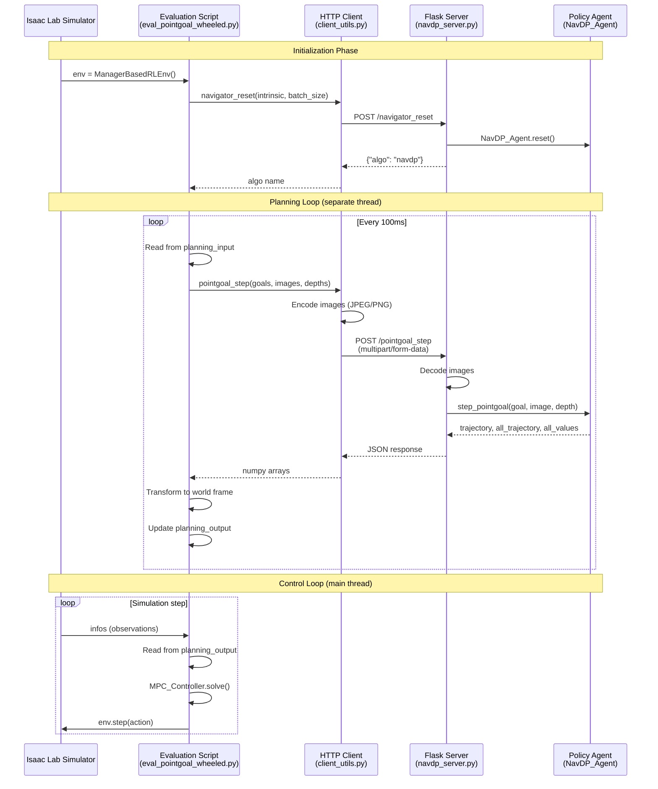

# NavDP Baseline Integration

This document describes how NavDP integrates various navigation baselines and communicates with simulators.

## Overview

NavDP provides a unified framework for evaluating multiple navigation policy baselines through a decoupled HTTP-based architecture. This design allows policies to run on separate GPUs while maintaining a consistent interface across different algorithms.

## Integrated Baselines

NavDP integrates **8 different navigation baselines**:

| Baseline        | Type               | Goal Support                        | Key Features                                |
| --------------- | ------------------ | ----------------------------------- | ------------------------------------------- |
| **NavDP**       | Diffusion Policy   | Point, Image, Pixel, No-Goal, Mixed | Multi-head architecture with DDPM scheduler |
| **ViNT**        | Visual Transformer | Image, No-Goal                      | Temporal context with attention mechanism   |
| **NoMaD**       | Diffusion Model    | Image, No-Goal                      | Distance prediction + diffusion action      |
| **GNM**         | General Navigation | Image, No-Goal                      | Distance-based with image goal conditioning |
| **ViPlanner**   | Semantic Planning  | Point Goal                          | Uses Mask2Former for semantic segmentation  |
| **iPlanner**    | Depth-based        | Point Goal                          | Direct depth-to-waypoint planning           |
| **LoGoPlanner** | Local-Global       | Point, No-Goal                      | Hierarchical with context frames            |
| **DDPPO**       | RL-based           | Point Goal                          | Discrete actions (stop/forward/turn)        |

## Directory Structure

```
third_party/NavDP/baselines/
├── navdp/           # NavDP diffusion policy
├── vint/            # Visual Navigation Transformer
├── nomad/           # NoMaD diffusion model
├── gnm/             # General Navigation Model
├── viplanner/       # Semantic visual planner
├── iplanner/        # Depth-based planner
├── logoplanner/     # Local-Global planner
└── ddppo/           # DD-PPO RL baseline
```

## Common Interface Pattern

All baselines follow a consistent **Agent pattern** with these core methods:

```python
class BaseAgent:
    def __init__(self, image_intrinsic, model_path, model_config_path, ...):
        """Initialize the agent with camera intrinsics and model weights."""

    def reset(self, batch_size):
        """Reset the agent for a new episode with given batch size."""
        self.memory_queue = [[] for i in range(batch_size)]

    def reset_env(self, i):
        """Reset a specific environment in the batch."""
        self.memory_queue[i] = []

    def callback_obs(self, imgs):
        """Update observation memory queue."""

    def step_pointgoal(self, goal, image, depth):
        """Generate trajectory for point goal navigation."""

    def step_imagegoal(self, goal_image, image, depth):
        """Generate trajectory for image goal navigation."""

    def step_nogoal(self, image, depth):
        """Generate trajectory for exploration (no goal)."""
```

## Trajectory Optimization

All baselines use a shared `TrajOpt` module for cubic spline interpolation:

```python
class TrajOpt:
    def TrajGeneratorFromPFreeRot(self, preds, step=0.1):
        """Convert waypoint predictions to smooth trajectories.

        Args:
            preds: Predicted waypoints [batch, num_points, dims]
            step: Interpolation step size

        Returns:
            Smooth trajectory waypoints
        """
```

## Simulator Communication

### Architecture

NavDP uses a **decoupled HTTP-based architecture**:

```
┌─────────────────┐     HTTP/REST      ┌─────────────────┐
│  Isaac Lab      │◄──────────────────►│  Flask Server   │
│  Simulator      │    (localhost)     │  (Policy)       │
└─────────────────┘                    └─────────────────┘
```

### Communication Sequence Diagram



### API Endpoints

Each baseline exposes its functionality through Flask REST APIs:

| Endpoint               | Method | Input                                       | Output                                 |
| ---------------------- | ------ | ------------------------------------------- | -------------------------------------- |
| `/navigator_reset`     | POST   | `intrinsic`, `batch_size`, `stop_threshold` | `{"algo": "..."}`                      |
| `/navigator_reset_env` | POST   | `env_id`                                    | `{"algo": "..."}`                      |
| `/pointgoal_step`      | POST   | image, depth, goal_x, goal_y                | trajectory, all_trajectory, all_values |
| `/imagegoal_step`      | POST   | image, depth, goal_image                    | trajectory, all_trajectory, all_values |
| `/nogoal_step`         | POST   | image, depth                                | trajectory, all_trajectory, all_values |
| `/pixelgoal_step`      | POST   | image, depth, pixel_x, pixel_y              | trajectory, all_trajectory, all_values |

### HTTP Client Usage

```python
from utils_tasks.client_utils import navigator_reset, pointgoal_step

# Initialize
algo = navigator_reset(
    intrinsic=camera_intrinsic.cpu().numpy(),
    batch_size=num_envs,
    stop_threshold=-0.5,
    port=8888
)

# Step
trajectory, all_trajectory, all_values = pointgoal_step(
    point_goals=goals,
    rgb_images=images,
    depth_images=depths,
    port=8888
)
```

### Data Encoding

- **RGB Images**: JPEG encoding (lossy, bandwidth-efficient)
- **Depth Images**: 16-bit PNG (lossless, scaled by 10000 for mm precision)
- **Response**: JSON with nested lists (numpy-serializable)

## Dual-Threaded Execution

The evaluation scripts use **two threads** for asynchronous operation:

1. **Planning Thread** (~10Hz): Runs policy inference asynchronously
2. **Control Thread** (simulation rate): Executes MPC control

```python
# Shared state
planning_input = PlanningInput()   # Observations from simulator
planning_output = PlanningOutput()  # Trajectories from policy

# Planning thread
def planning_thread(env, camera_intrinsic):
    while not stop_event.is_set():
        trajectory = pointgoal_step(goal, image, depth, port=port)
        # Transform camera frame → world frame
        planning_output.trajectory_points_world = transform(trajectory)

# Main control loop
while simulation_app.is_running():
    # MPC control using latest trajectory
    opt_u, opt_x = mpc.solve(current_pose)
    obs, rewards, dones, infos = env.step(action)
```

## Running Evaluations

### Start Policy Server

```bash
# NavDP
cd third_party/NavDP/baselines/navdp
python navdp_server.py --port 8888 --checkpoint ./checkpoints/model.ckpt

# Or other baselines (e.g., NoMaD)
cd third_party/NavDP/baselines/nomad
python nomad_server.py --port 8888 --checkpoint ./checkpoints/nomad.pth
```

### Run Evaluation

```bash
cd third_party/NavDP

# Point goal navigation
python eval_pointgoal_wheeled.py \
    --scene_dir ./asset_scenes/cluttered_easy \
    --num_envs 4 \
    --port 8888

# Image goal navigation
python eval_imagegoal_wheeled.py \
    --scene_dir ./asset_scenes/cluttered_easy \
    --port 8888

# No goal (exploration)
python eval_nogoal_wheeled.py \
    --scene_dir ./asset_scenes/cluttered_easy \
    --port 8888
```

## Output Format

All baselines return a consistent output format:

```python
{
    "trajectory": [[x, y, theta], ...],      # Executable waypoints
    "all_trajectory": [[[x, y, theta], ...], ...],  # All sampled trajectories
    "all_values": [[v1, v2, ...], ...]       # Confidence scores per trajectory
}
```

## Design Benefits

1. **Decoupling**: Policy server runs independently, can be on different GPU
2. **Language-agnostic**: Any simulator supporting HTTP can use the baselines
3. **Batched inference**: Multiple environments share one policy server
4. **Async planning**: Control loop doesn't block on neural network inference
5. **Easy debugging**: Can test policy server independently with curl/Postman
6. **Unified benchmarking**: Fair comparison across different algorithms

## Adding New Baselines

To add a new baseline:

1. Create a new directory under `baselines/`
2. Implement the agent class following the common interface
3. Create a Flask server with the standard endpoints
4. Add configuration files (model config, robot config)

Example structure:

```
baselines/my_baseline/
├── my_agent.py          # Agent implementation
├── my_network.py        # Neural network model
├── my_server.py         # Flask server
├── traj_opt.py          # Trajectory optimization (can reuse)
└── configs/
    ├── model.yaml
    └── robot_config.yaml
```

## References

- [NavDP Paper](https://arxiv.org/abs/...)
- [ViNT: A Foundation Model for Visual Navigation](https://arxiv.org/abs/2306.14846)
- [NoMaD: Goal Masked Diffusion Policies](https://arxiv.org/abs/2310.07896)
- [GNM: A General Navigation Model](https://arxiv.org/abs/2210.03370)
- [ViPlanner: Visual Semantic Imperative Learning](https://arxiv.org/abs/2310.00982)
