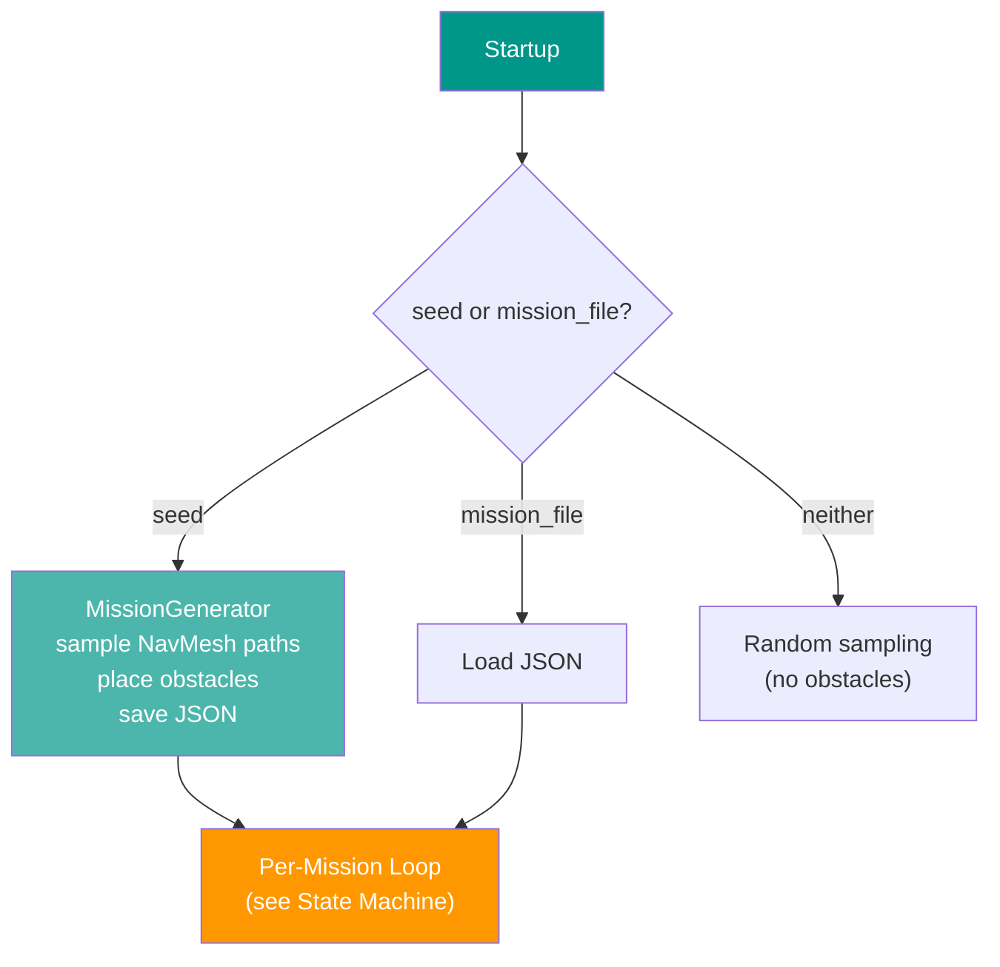

# :construction: Obstacle Spawning

CostNav supports deterministic obstacle placement for benchmarking robot navigation under varying difficulty levels. Missions are pre-generated from a seed and saved as JSON for reproducible evaluation across baselines.

---

## :brain: Overview

The obstacle system generates three difficulty levels:

| Difficulty | Missions | Obstacle Types | Placement Strategy |
|:-----------|:---------|:---------------|:-------------------|
| **None** | 50 | — | Clean path, no obstacles |
| **Easy** | 25 | common, minor | 2–3 small objects near path (1–2 m offset), avoidable without detour |
| **Hard** | 25 | common, minor, major | Objects directly on path chokepoints, forces detour |

### Obstacle Types

| Type | Directory | Size | Examples |
|:-----|:----------|:-----|:---------|
| `common` | `Object/common/` | 1.0–3.0 m | Benches, trash bins, bicycles, mailboxes |
| `major` | `Object/major/` | ≥ 3.0 m | Trees, lamp posts, traffic lights, signs |
| `minor` | `Object/minor/` | < 1.0 m | Cones, bags, bollards, small plants |
| `unseen` | `Object/unseen/` | Mixed | WoRV test objects (chairs, desks, pots) |

Major, minor, common assets sourced from [URBAN-SIM](https://github.com/metadriverse/urban-sim) (Apache 2.0). Unseen assets are WoRV property.

### Architecture

Obstacle spawning integrates into the mission [state machine](isaacsim_guide.md#state-machine). During the **Setup** phase:

1. **READY**: Pause people, remove old obstacles, load mission config (start/goal/waypoints/obstacles)
2. **TELEPORTING**: Teleport robot to start position
3. **SETTLING**: Check robot fall (retry up to 3x), spawn obstacles, generate topomap from cached waypoints, resume people



---

## :gear: Configuration

Obstacle settings are configured in `mission_config.yaml` under the `obstacles` section:

```yaml
obstacles:
  # Seed for deterministic mission generation (null = disabled)
  seed: 42

  # OR load pre-generated missions (mutually exclusive with seed)
  # mission_file: /workspace/config/missions/42.json

  # Output directory for generated mission JSON files
  output_dir: /workspace/config/missions

  # Number of missions per difficulty level
  num_none: 50
  num_easy: 25
  num_hard: 25
```

When `seed` is set, missions are generated at startup and saved to `{output_dir}/{seed}.json`. On subsequent runs, set `mission_file` to skip regeneration and ensure identical missions.

---

## :rocket: Quick Start

### 1. Ensure Assets Are Available

```bash
make download-assets-hf   # Download assets from Hugging Face
make start-nucleus         # Start local Nucleus server
```

Assets must be at `omniverse://localhost/Users/worv/Object/{common,major,minor,unseen}/`.

### 2. Configure and Run

Edit `costnav_isaacsim/costnav_isaacsim/config/mission_config.yaml`:

```yaml
obstacles:
  seed: 42
```

Then run:

```bash
make run-isaac-sim
```

The first run generates missions and saves `config/missions/42.json`. Subsequent runs with the same seed produce identical results.

### 3. Distribute for Reproducibility

Share the generated JSON file with collaborators:

```yaml
obstacles:
  mission_file: /workspace/config/missions/42.json
```

All baselines using the same JSON will run identical missions with identical obstacle placements.

---

## :snake: Python API

### Generate Missions Programmatically

```python
from costnav_isaacsim.mission_manager.navmesh_sampler import NavMeshSampler
from costnav_isaacsim.mission_manager.mission_generator import (
    MissionGenerator,
    save_missions,
    load_missions,
)

# Requires a loaded USD stage with baked NavMesh
sampler = NavMeshSampler(min_distance=20.0, max_distance=100.0)

# Generate 100 missions with seed 42
generator = MissionGenerator(sampler, seed=42)
missions = generator.generate(num_none=50, num_easy=25, num_hard=25)

# Save for distribution
save_missions(missions, "config/missions/42.json", seed=42)

# Load saved missions
missions = load_missions("config/missions/42.json")
```

### Spawn Obstacles Directly

```python
from omni.isaac.obstacle.obstacle_setup import ObstacleSetup
from omni.isaac.obstacle.impl.models import ObstacleType

obstacle_setup = ObstacleSetup()

# Spawn 5 random obstacles from all types
obstacle_setup.load_random_obstacles(5, ObstacleType.ALL)

# Spawn at specific positions
obstacle_setup.load_obstacles([(10.0, 5.0), (20.0, -3.0)], ObstacleType.MAJOR)

# Remove all
obstacle_setup.remove_obstacles(list(obstacle_setup.obstacle_data_dict.keys()))
```

---

## :file_folder: Mission JSON Format

```json
{
  "map": "Street_sidewalk",
  "seed": 42,
  "generated_at": "2026-04-06T12:00:00+00:00",
  "num_missions": 100,
  "missions": [
    {
      "id": 0,
      "difficulty": "none",
      "start": {"x": 12.0, "y": 5.3, "z": 0.0, "heading": 1.57},
      "goal": {"x": 45.2, "y": -3.1, "z": 0.0},
      "waypoints": [[12.0, 5.3], [15.0, 4.0], [20.0, 2.5]],
      "obstacles": []
    },
    {
      "id": 75,
      "difficulty": "hard",
      "start": {"x": 8.0, "y": 2.1, "z": 0.0, "heading": 0.78},
      "goal": {"x": 38.0, "y": -1.5, "z": 0.0},
      "waypoints": [[8.0, 2.1], [12.0, 1.8], [18.5, 2.0]],
      "obstacles": [
        {
          "usd_path": "major/Tree_abc123.usd",
          "type": "major",
          "x": 18.5, "y": 2.0, "z": 0.0,
          "rotation": 90.0
        }
      ]
    }
  ]
}
```

---

## :shield: Mission Stability

The system includes safeguards against simulation instabilities:

| Feature | Description |
|:--------|:------------|
| **People pause** | Characters freeze during mission reset (teleport + obstacle spawn) to prevent collisions |
| **Robot fall detection** | Checks orientation after physics settling; retries teleport up to 3 times |
| **Dynamic obstacle avoidance** | When PeopleAPI is loaded, obstacles register with `GlobalCharacterPositionManager` — people dynamically avoid them without NavMesh rebake |

---

## :link: Third-Party Extension

The obstacle spawning logic lives in the [ObstacleAssets](https://github.com/worv-ai/ObstacleAssets) extension (`third_party/ObstacleAssets/`), a standalone Isaac Sim extension without ROS2 dependencies. PeopleAPI integration is optional — when loaded, obstacles get dynamic avoidance behavior scripts.

```bash
# Fetch submodule
git submodule update --init third_party/ObstacleAssets
```

See `third_party/ObstacleAssets/README.md` for extension API documentation.
