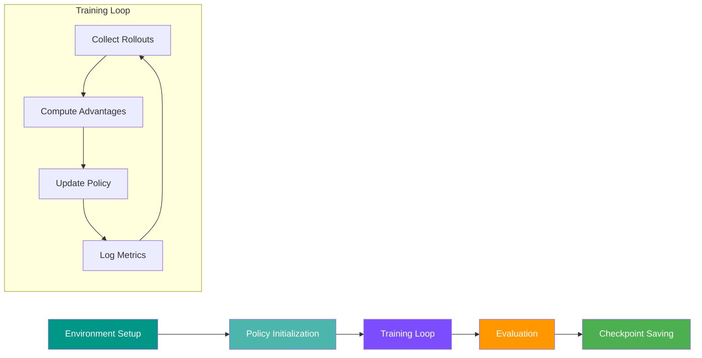
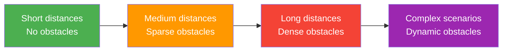

# :mortar_board: Training Guide

This guide explains how to train navigation policies in CostNav, including the training pipeline, hyperparameters, and best practices.

---

## :railway_track: Training Pipeline Overview



---

## :package: Supported RL Frameworks

CostNav supports multiple RL frameworks:

| Framework | Status | Description |
|:----------|:------:|:------------|
| **RL-Games** | :star: Recommended | Default framework, optimized for Isaac Lab |
| **RSL-RL** | :zap: Fast | Lightweight, fast iteration |
| **Stable-Baselines3** | :books: Well-documented | Popular, extensive documentation |
| **SKRL** | :jigsaw: Modular | Flexible, modular design |

---

## :joystick: Training with RL-Games

### :rocket: Basic Training Command

```bash
cd costnav_isaaclab
python scripts/rl_games/train.py \
    --task=Template-Costnav-Isaaclab-v2-NavRL \
    --enable_cameras \
    --headless
```

### :keyboard: Command-Line Arguments

#### Task Selection

```bash
--task=TASK_NAME
```

| Task | Description |
|:-----|:------------|
| `Template-Costnav-Isaaclab-v0` | :test_tube: CartPole baseline |
| `Template-Costnav-Isaaclab-v1-CustomMap` | :world_map: Custom map navigation |
| `Template-Costnav-Isaaclab-v2-NavRL` | :star: Full navigation with RL (recommended) |

#### Camera Control

=== "With Cameras"

    ```bash
    python scripts/rl_games/train.py --task=... --enable_cameras
    ```

    Policy uses visual observations (RGB-D images)

=== "Without Cameras"

    ```bash
    python scripts/rl_games/train.py --task=...
    ```

    Policy uses only vector observations (goal position, velocity)

#### Rendering Mode

=== "Headless (Faster)"

    ```bash
    python scripts/rl_games/train.py --task=... --headless
    ```

    :zap: No visualization, maximum performance. Best for cluster training.

=== "With GUI"

    ```bash
    python scripts/rl_games/train.py --task=...
    ```

    :tv: Shows simulation. Useful for debugging.

#### Number of Environments

```bash
--num_envs=64       # Number of parallel environments
```

!!! tip "Environment Count"
    - More environments = faster data collection
    - Limited by GPU memory
    - Default: 64 (good balance for most GPUs)

#### Checkpoint Management

```bash
--resume            # Resume from latest checkpoint
--checkpoint=PATH   # Resume from specific checkpoint
```

---

## :jigsaw: Training with SKRL

### :rocket: Basic Training Command

```bash
cd costnav_isaaclab
python scripts/skrl/train.py \
    --task=Template-Costnav-Isaaclab-v2-NavRL \
    --enable_cameras \
    --headless
```

### :keyboard: SKRL Command-Line Arguments

#### Basic Arguments

```bash
--task=TASK_NAME     # Environment name (required)
--enable_cameras     # Enable RGB-D camera observations
--headless           # Run without GUI (faster)
--num_envs=64        # Number of parallel environments
--seed=42            # Random seed
--checkpoint=PATH    # Resume from specific checkpoint
```

#### Wandb Tracking

```bash
--track                        # Enable wandb tracking
--wandb-project-name=PROJECT   # Wandb project name
--wandb-entity=ENTITY          # Wandb entity (username or team)
--wandb-name=RUN_NAME          # Custom run name
```

??? example "Full Training Command with Wandb"

    ```bash
    python scripts/skrl/train.py \
        --task=Template-Costnav-Isaaclab-v2-NavRL \
        --enable_cameras \
        --headless \
        --num_envs=64 \
        --track \
        --wandb-project-name=costnav \
        --wandb-entity=my-team \
        --wandb-name=skrl-ppo-run-1
    ```

---

## :gear: Training Configuration

### PPO Hyperparameters

??? example "Full Configuration Example"

    ```yaml
    params:
      algo:
        name: a2c_continuous

      model:
        name: continuous_a2c_logstd

      network:
        name: actor_critic
        separate: False
        space:
          continuous:
            mu_activation: None
            sigma_activation: None
            mu_init:
              name: default
            sigma_init:
              name: const_initializer
              val: 0
            fixed_sigma: True

        mlp:
          units: [256, 128, 64]
          activation: elu
          d2rl: False
          initializer:
            name: default
          regularizer:
            name: None

      config:
        name: Template-Costnav-Isaaclab-v2-NavRL
        env_name: isaacgym
        multi_gpu: False
        ppo: True
        mixed_precision: False
        normalize_input: True
        normalize_value: True
        value_bootstrap: True
        num_actors: 64
        reward_shaper:
          scale_value: 1.0
        normalize_advantage: True
        gamma: 0.99
        tau: 0.95
        learning_rate: 3e-4
        lr_schedule: adaptive
        kl_threshold: 0.008
        score_to_win: 20000
        max_epochs: 10000
        save_best_after: 100
        save_frequency: 100
        grad_norm: 1.0
        entropy_coef: 0.0
        truncate_grads: True
        e_clip: 0.2
        horizon_length: 24
        minibatch_size: 1024
        mini_epochs: 5
        critic_coef: 2
        clip_value: True
        seq_len: 4
        bounds_loss_coef: 0.0001
    ```

### :brain: Key Parameters Explained

#### Network Architecture

| Parameter | Value | Description |
|:----------|:------|:------------|
| `units` | `[256, 128, 64]` | Hidden layer sizes |
| `activation` | `elu` | Activation function (ELU is smooth, helps training) |
| `separate` | `False` | Shared trunk for actor and critic |

#### PPO Settings

| Parameter | Value | Description |
|:----------|:------|:------------|
| `gamma` | `0.99` | Discount factor (how much to value future rewards) |
| `tau` | `0.95` | GAE lambda (advantage estimation) |
| `learning_rate` | `3e-4` | Adam learning rate |
| `e_clip` | `0.2` | PPO clipping parameter |
| `entropy_coef` | `0.0` | Entropy bonus (0 = no exploration bonus) |

#### Training Loop

| Parameter | Value | Description |
|:----------|:------|:------------|
| `horizon_length` | `24` | Steps per rollout |
| `minibatch_size` | `1024` | Samples per gradient update |
| `mini_epochs` | `5` | Optimization epochs per rollout |
| `num_actors` | `64` | Parallel environments |

---

## :chart_with_upwards_trend: Training Process

### Phase 1: Initialization (Epochs 0-100) :seedling:


**What happens:**

- Policy explores randomly
- Observation normalization statistics collected
- High variance in rewards
- Many collisions and timeouts

**Expected behavior:**

| Metric | Value |
|:-------|:------|
| Success rate | 0-5% |
| Average reward | -100 to 0 |
| Episode length | Full timeout |

!!! info "Don't Panic!"
    Poor performance is expected. Focus on verifying observations and rewards are computed correctly.

---

### Phase 2: Learning (Epochs 100-1000) :books:


**What happens:**

- Policy learns to avoid collisions
- Begins moving towards goals
- Success rate increases
- Reward variance decreases

**Expected behavior:**

| Metric | Value |
|:-------|:------|
| Success rate | 5-30% |
| Average reward | 0-5000 |
| Episode length | Decreasing |

!!! tip "Monitoring Tips"
    - Monitor reward components (arrival, collision, progress)
    - Check if policy is stuck in local optima
    - Adjust reward weights if needed

---

### Phase 3: Refinement (Epochs 1000+) :star:


**What happens:**

- Policy optimizes trajectory efficiency
- Success rate plateaus
- Learns to handle edge cases
- Reduces unnecessary movements

**Expected behavior:**

| Metric | Value |
|:-------|:------|
| Success rate | 30-50% |
| Average reward | 5000-10000 |
| Episode length | Stable, efficient |

---

## :bar_chart: Monitoring Training

### TensorBoard

Launch TensorBoard to monitor training:

```bash
tensorboard --logdir costnav_isaaclab/logs/rl_games --port 6006
```

Open browser to `http://localhost:6006`

### :mag: Key Metrics

=== "Rewards"

    | Metric | Description |
    |:-------|:------------|
    | `rewards/frame` | Total reward per step |
    | `rewards/iter` | Total reward per iteration |
    | `rewards/time` | Total reward over time |

=== "Success Metrics"

    | Metric | Description |
    |:-------|:------------|
    | `Episode/arrive_rate` | :white_check_mark: Percentage of successful episodes |
    | `Episode/collision_rate` | :x: Percentage of collision episodes |
    | `Episode/timeout_rate` | :hourglass: Percentage of timeout episodes |

=== "Policy Metrics"

    | Metric | Description |
    |:-------|:------------|
    | `losses/a_loss` | Actor loss |
    | `losses/c_loss` | Critic loss |
    | `losses/entropy` | Policy entropy (exploration) |
    | `losses/kl` | KL divergence (policy change magnitude) |

=== "Cost Metrics"

    | Metric | Description |
    |:-------|:------------|
    | `cost_model/energy_per_episode` | :zap: Energy consumption |
    | `cost_model/sla_compliance` | :clock1: SLA compliance rate |
    | `cost_model/operating_margin` | :moneybag: Profit margin |
    | `cost_model/break_even_time` | :chart_with_downwards_trend: Time to break even |

---

## :hammer_and_wrench: Troubleshooting

### :warning: Training is unstable (reward oscillates wildly)

??? solution "Solutions"
    1. :arrow_down: Reduce learning rate: `learning_rate: 1e-4`
    2. :arrow_up: Increase minibatch size: `minibatch_size: 2048`
    3. :scissors: Reduce PPO clip: `e_clip: 0.1`
    4. :white_check_mark: Check observation normalization is enabled

### :zzz: Policy doesn't learn (reward stays flat)

??? solution "Solutions"
    1. :test_tube: Check reward function with `test_v2_rewards.py`
    2. :eye: Verify observations are informative (not constant)
    3. :arrow_up: Increase learning rate: `learning_rate: 5e-4`
    4. :compression: Reduce network size: `units: [128, 64]`
    5. :mag: Check for NaN/Inf in observations or rewards

### :video_game: Policy exploits reward function

??? solution "Solutions"
    1. :heavy_plus_sign: Add slack penalty to progress reward
    2. :heavy_multiplication_x: Increase collision penalty weight
    3. :wavy_dash: Add smoothness penalty (action changes)
    4. :mortar_board: Use curriculum learning (start with easier goals)

### :boom: Out of memory

??? solution "Solutions"
    1. :arrow_down: Reduce environments: `--num_envs=32`
    2. :no_entry: Disable cameras: Remove `--enable_cameras`
    3. :compression: Reduce image resolution
    4. :zap: Use mixed precision: `mixed_precision: True`

### :snail: Training is too slow

??? solution "Solutions"
    1. :desktop_computer: Use headless mode: `--headless`
    2. :arrow_up: Increase environments: `--num_envs=128`
    3. :fast_forward: Reduce rendering interval
    4. :zap: Use faster framework (RSL-RL)
    5. :mute: Disable unnecessary logging

---

## :bulb: Best Practices

### 1. :baby: Start Simple

- [x] Train without cameras first (faster, easier to debug)
- [x] Use smaller network (faster training)
- [x] Shorter episodes (faster iteration)

### 2. :white_check_mark: Validate Incrementally

- [x] Test reward function with `test_v2_rewards.py`
- [x] Test controller with `test_controller.py`
- [x] Verify observations are reasonable

### 3. :balance_scale: Use Baselines

- [x] Compare against random agent (`random_agent.py`)
- [x] Compare against zero agent (`zero_agent.py`)
- [x] Compare against deterministic controller

### 4. :control_knobs: Hyperparameter Tuning

- [x] Start with default hyperparameters
- [x] Change one parameter at a time
- [x] Use grid search or Bayesian optimization

### 5. :repeat: Reproducibility

- [x] Set random seeds in config
- [x] Save all hyperparameters
- [x] Version control your configs
- [x] Document changes and results

---

## :rocket: Advanced Topics

### :mortar_board: Curriculum Learning

Gradually increase task difficulty:



### :globe_with_meridians: Multi-Task Learning

Train on multiple scenarios simultaneously:

- :cityscape: Urban environments
- :house_with_garden: Suburban environments
- :national_park: Rural environments
- :cloud: Different weather conditions

### :arrow_right: Transfer Learning

1. Pre-train on simple task
2. Fine-tune on complex task
3. Use frozen feature extractor
4. Progressive unfreezing

### :computer: Distributed Training

```bash
# SLURM cluster
sbatch train.sbatch

# Multi-GPU
python scripts/rl_games/train.py --task=... --multi_gpu=True
```

---

## :checkered_flag: Next Steps

After training:

1. :bar_chart: **Evaluate**: Use `evaluate.py` to test on held-out scenarios
2. :tv: **Visualize**: Use `play.py` to watch trained policy
3. :chart_with_upwards_trend: **Analyze**: Export metrics and create plots
4. :package: **Deploy**: Convert policy to deployment format (ONNX, TorchScript)
